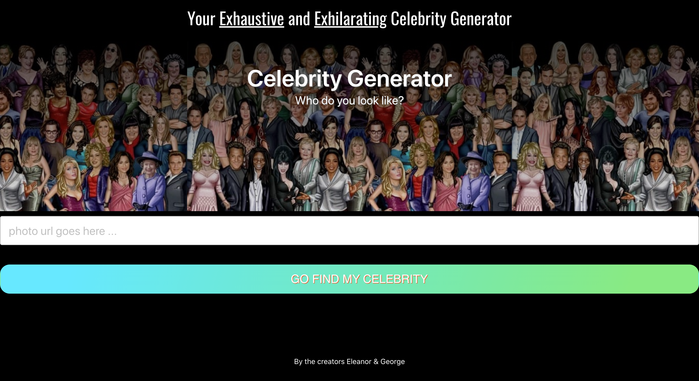
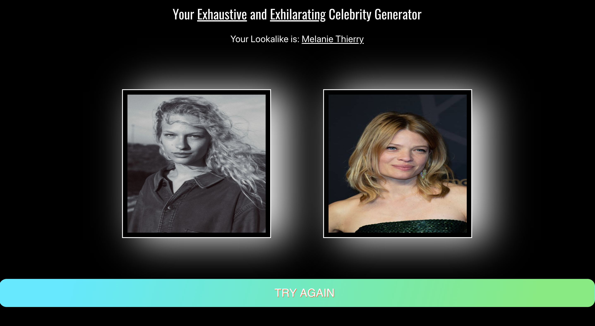

# Project 2: React Hackathon to integrate with third party API

# Brief

Consume at least one public API into a React application to create a fun or useful product . Have several components, at least one classical and one functional. Be deployed online and accessible to the public.

Timeframe: 36 hours

# Technologies used:

* ReactJS
* Express
* NodeJS
* Axios
* SASS
* Bulma
* HTML5
* CSS
* JavaScript

# Contributors

[George Jones](https://github.com/Jompra)

# Deployment 

This website is deployed on Netlify and can be found [here](https://your-celeb-face.netlify.app/)

# Getting Started

To run this app you will need to clone or download the files and sign up for the two APIs used: 

[Luxand Cloud](https://rapidapi.com/aboykov/api/luxand-cloud-face-recognition?endpoint=apiendpoint_188c3cc8-6f87-4558-a9c7-be772a5a7ccf) 

[Microsoft Azure](https://azure.microsoft.com/en-gb/free/search/?&ef_id=CjwKCAjw2a32BRBXEiwAUcugiISGAMerV2gAqqtH0Va-SKRbGl6PQg7R1nJVHepxe0Jw54XQ_vvbPRoCFH4QAvD_BwE:G:s&OCID=AID2000125_SEM_CjwKCAjw2a32BRBXEiwAUcugiISGAMerV2gAqqtH0Va-SKRbGl6PQg7R1nJVHepxe0Jw54XQ_vvbPRoCFH4QAvD_BwE:G:s&dclid=CjkKEQjw2a32BRCwkfevsaHM07IBEiQAOHSxZRMAtT9DP8wOMrB3t3Ey1nc54XpMnbMwqVuQT1vdQjnw_wcB)


 Add the keys to a `.env` file, making sure they look like the below example

```
REACT_APP_AZURE_KEY = Azure API Key
REACT_APP_RAPID_KEY = Rapid API Key
```

Then run 

`$ npm i `

or

`$ yarn install `

to start 


# Project 

This fun, quick and easy to use website is made up of a homepage and a results page.  As a pair we wanted to build something that could be enjoyed by everyone. Our final product was a celebrity generator where users can upload an image URL of themselves and see who their celebrity lookalike is. 

# Screenshot walk through 

The homepage where users can upload a URL image into the generator bar.




The results page displays the user’s image plus their celebrity lookalike’s name and image.





# Wins and Blockers 

I was really happy with our idea to use the Luxand Cloud Celebrity Recognition API. Originally designed for journalists to pick out known celebrities from photographs we were able to use this to our advantage as even if the image used was not a known celebrity, the API still returns the closest match.

A real win was deciding to integrate with the Microsoft Azure Cloud Bing Image Search API. We felt it was better for the user experience to see the celebrity image as well as a name and Bing was by far the most reliable API when searching less well known celebrities in the search term. 


This was my first project pair coding and I really enjoyed working with someone else as a team. We both brought different strengths to the project and I learnt a lot in a short amount of time. Our communication was clear and efficient which meant we were able to build a really successful app that was in-line with our original brief. 


I was really happy with our shuffle card feature in the results page. Designed to add a bit of suspense to the user experience, we created a loading effect that I think worked nicely. 


```
  shufflePictures = () => { 
    let i = 0
    const shuffle = setInterval(() => {
      /if/ (*this*.state.lookalike){
        clearInterval(shuffle)
        /return/
      } 
      *this*.setState({ celebImage: *this*.state.stockImages[i] })
      /if/ (i === *this*.state.stockImages.length - 1){
        i = 0
      } /else/ {
        i++
      }
    }, 300)
  }
```

# Future Features 

With more time I would have liked to give users the ability to upload an image of themselves instead of a URL. 
I would also like to the make the design responsive.  


